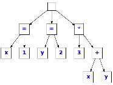

# jua

Jua is a lua interpreter implemented in java.

It features a CLI (repl + interpreter for files) and a web application.

You can access the web application [here](http://jua.herokuapp.com)  (disclaimer it won't work in https because it's using heroku's free tier).

## Installation

### Requirements:

- Java 11 or later
- Gradle 5 or later

[**SDKMAN!**](https://sdkman.io/) is a good solution to install and manage Gradle, Java SDK, etc...

### Setup

Clone the project:

```bash
git clone git@github.com:jua-cs/jua.git
```

## Usage

To build jua you can run:

`./gradlew assemble`

This will build a jar in `./build/libs/jua-0.0.0.jar`

that you can run doing:

`java -jar ./build/libs/jua-0.0.0.jar --help` (this will prompt you the help of the Jua CLI)

## Tooling

To setup the pre-commit hooks (checks for linting of both the backend and the frontend) you can run:

`./gradlew installGitHooks`

You can also use the scripts in `./scripts`

- `start-front-dev` starts the frontend in development mode

You can also run the whole stack using [docker](https://www.docker.com/) or [podman](https://podman.io/):

`docker build . -t jua && docker run -p 127.0.0.1:3000:3000 jua`

Then just launch your favorite browser and head to `http://localhost:3000/` to execute some *lua*.

## Architecture

Let's describe the architecture of the project. We'll start by the first parts which have been built. It explains how a given string, representing some *lua* code, is processed and interpreted.


### Lexer

[`/src/main/java/jua/lexer`](./src/main/java/jua/lexer)
=======


The job of the *Lexer* is to transform the input (a stream of strings) into a stream of *Tokens*.

#### Tokens

*Tokens* are the first abstraction around the text input. Basically, it separates words and punctuation, and try to give them some meaning.
We have several types of Tokens :

- **Operator**: these are all the symbols which operate on arguments: *+*, *-*, */*,etc...
- **Keyword**: Reserved names for the language like *if*, *for*, *end*, etc...
- **Separator**: Punctuation characters, delimiters like : *(*, *}*, *,*, etc...
- **Literal**: explicit number, textual, data: *3.4*, *0xff*, *"hello"*
- **Identifier**: name chosen by the programmer for a variable, function: *x*, *myFunction*
- **Special**: invalid token, end of line

The tokens for the *jua* language are defined in [src/main/java/jua/token](./src/main/java/jua/token). There is a main **abstract** class [Token](./src/main/java/jua/token/Token.java) from which all the the other tokens ([*TokenOperator*](./src/main/java/jua/token/TokenOperator.java), [*TokenKeyword*](./src/main/java/jua/token/TokenKeyword.java), etc...) inherit. The base attributes a Token has are : line, position on this line and literal, which is the explicit *string* from the code.

*Enumerations* are used to list all the explicit tokens we expect to encounter inside a given token type.

A [*TokenFactory*](./src/main/java/jua/token/TokenFactory.java), which follows the **Factory Pattern**, is used to instantiate all the Tokens.

#### How does the Lexer works ?

By looking *character by character*, the **Lexer** returns a stream of Tokens. With a simple *switch statement*, it can determinate the correct token. If we found a `(`, it returns a `TokenDelimiter("(")` .

Sometimes, for example for `*<=*`, it needs to look ahead for the next characters. Therefore, when it finds a `<`, it *peeks* the next characters, to distinguish `<<` , `<=` or just `<`.

Then, it handles others tokens like literals and identifiers.

### Parser

The job of **Parser** transforms the stream of Tokens from the **Lexer** into an **Abstract Syntax Tree** (AST).

From [Wikipedia](https://en.wikipedia.org/wiki/Abstract_syntax_tree):
> In computer science, an abstract syntax tree (AST), or just syntax tree, is a tree representation of the abstract syntactic structure of source code written in a programming language. Each node of the tree denotes a construct occurring in the source code. 

For example for a simple statement like : 

```lua
x = 1
y = 2
3 * (x + y)
```

We'll have this AST: 



The AST is composed of two types of elements : *Expressions* and *Statements*.

A *statement* is the base of the program, something to execute. A lua program is list of *statements*: variable definition of assignements, function definition or procedure execution. A statement is composed of several others statements and expressions. *Expressions* returns a result from the computation of the inside.

